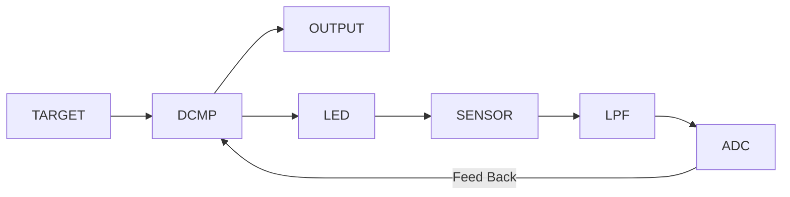

---
tags:
  - 嵌入式
  - PWM
  - Delta-Sigma调制
---

# 光透过率计-原理篇-其二

[上回说到](../../posts/20251028/index.md)，我们讨论了各种测量透过率的方案，最后讨论出使用PWM+闭环反馈来线性地测定样品的透光率。但是PWM方案不够好，我有更好的方案。上一期没写完，这期补充说明一下。

出于任务压力，我没办法像上期一样使用哈基米叙事。“把文案变得有趣”这样的工作，还是暂时留到未来吧。

## PWM调制的缺陷

当你使用PWM产生指定占空比的光时，似乎一切都在你的掌握之中，但是果真如此吗？

你想要读出16bit的透光度，那么你的PWM就至少要有16bit。假设你的载波频率是100kHz。那么你就需要给你的TIM外设输入6.5 GHz的时钟。这要是能做出来，65%人类感谢你。所以你必然降低载波频率。比如你用某不太知名南京厂商的144MHz主频的单片机，那么在16bit下你只能输出2.2kHz。

那你说：好，我不介意频率低，频率低就低嘛，反正接收端还要加个低通嘞。但是就算把载波频率降到只有2kHz，pwm依然有一些无法解决的问题。

在极低或者极高占空比情况下，比如说你要输出1/65536占空比的脉冲，这也就意味着，led每次只点亮1/144MHz = 6.9ns。专业的用于可见光通信的LED可能勉强达到这个速度，可是你让我用几分钱甚至几厘钱成本的LED跑到144MHz？要是真能做到，那恐怕1000%人类都要感谢你。

那再苦一苦载波频率，再降一降？让led最小的闪烁周期达到1μs，这样LED就不至于来不及响应了？好，2kHz除以144，最后你的载波频率变成了13.9Hz，比电竞帧率稍微高一点点，倒是可喜可贺。那接收端设计滤波器的朋友就要红温了：谁来给你设计截止频率只有几赫兹甚至零点几赫兹的滤波器啊？那延迟不得爆表？闭环还做不做了？

综上，用PWM无法实现高分辨率（高比特数）且占空比趋于极端值的闭环控制。

## PWM调制的缺陷：其二

好，就算抛高分辨率问题不谈，PWM就真的一点问题都没有了吗？

这就涉及到PWM的第二个缺陷：粒度粗。

你的adc辛辛苦苦地采样，然后cpu辛辛苦苦地跑PID控制算法，就是为了减小延迟，结果数据给到pwm这里，需要和pwm的载波频率进行同步。
什么意思呢？比如说，当前PWM正在输出90%占空比，现在你的闭环算法认为占空比应该减小到10%，这个指令是不会立即作用在输出波形上的，
而是会到下一个周期才能正式生效。

当然，从实现上是可以改善这个问题的，比如禁用cc的影子寄存器，然后在每个周期结束之前的一段时间内进行adc采样和pid计算（假定pwm的速度远低于adc和cpu），在下一个周期开始之前的瞬间更新cc寄存器，这样可以把延迟降到最低。

但是不管怎么说，你对占空比的控制，在时间上的最细粒度就是pwm的载波频率。而之前又提到，这个频率低之又低，这就导致控制算法难以收敛。

## 误差？单比特？

让我们重新开始思考：
我们有一个只能输出100%或0%光强的LED，我们的目标是使光电传感器的数值与目标值相等。然后读出LED输出的平均光强百分比。

那么不妨让我们试试，先让LED点亮一个周期，然后读取光电传感器。我们发现读到的值比目标值低。

既然读数偏低，存在误差，那我们第二个周期就让LED继续点亮，尝试修正这个误差。读出值确实有所上升，但是还是偏低。

让LED点亮了几个周期之后，读出值不断上升，已经高于目标值了，继续亮下去，误差只会越来越高。于是我们熄灭LED，让读数下降一些，误差减小一些。

很快，读数又变得低于目标值了，于是我们重新点亮LED，使得读数回升，继续削减误差。

就是通过这样的不停点亮和熄灭LED，我们将光电传感器的读数与目标值的误差降到极小，几乎完全相等。

然后我们统计LED在一段时间内点亮的时间的占比，不就得到LED输出的平均光强百分比了？

那就有懂的小朋友举手了：主播主播你这个不就是一阶DSM吗？

## Delta-Sigma调制

终极杀器，终于还是端上台面来了。让我们揭开她的盖头吧。

相比PWM+PID闭环控制对硬件性能以及对设计者水平的极致要求，DSM则简单得多，让我们逐个方面对比：

- **PWM+PID**：
    - 需要高分辨率的PWM发生器，对硬件要求很高
    - 需要在软件中计算PID，占用CPU资源
    - 需要高精度、高速度的ADC来采集输出反馈，采样时机和频率需要精心设计以避免噪声
    - 从采样、计算到更新PWM占空比，整个环路存在固有的计算和采样延迟，限制了系统的动态响应速度。

- **DSM**：
    - 直接输出单比特流，无需高分辨率PWM硬件
    - 算法极其简单，没有复杂的计算和调参
    - 噪声整形，无惧垃圾ADC
    - 它的操作是“逐周期”的。每个时钟周期，它都会根据误差立即决定输出是高还是低，几乎没有计算延迟，响应速度极快。

实际上，通过这种简单的开关控制，DSM可以在轻易等效16bit甚至更高的分辨率。

如此看，DSM确实爆杀PWM+PID闭环控制。
