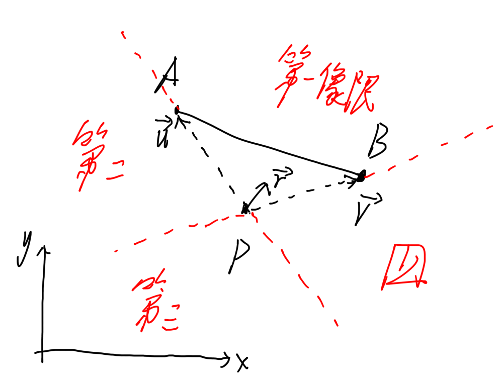
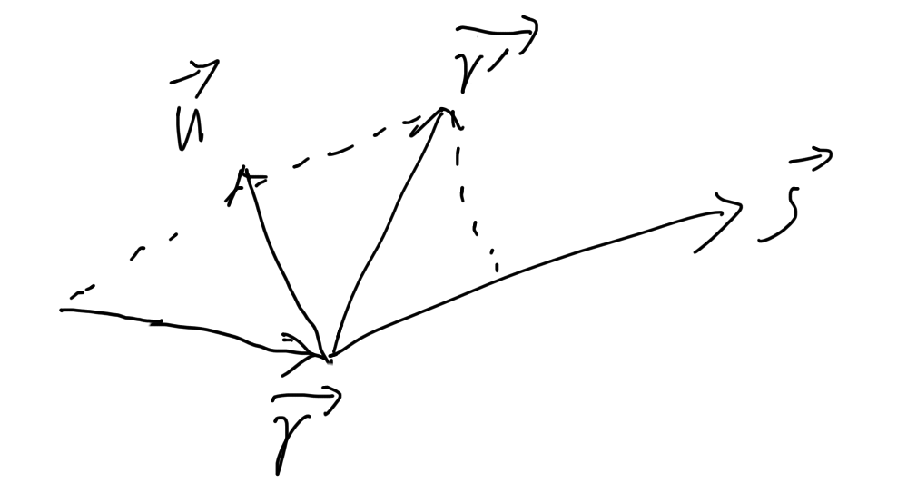

---
tags:
  - 算法
  - 几何
  - 线性代数
---
# 二维平面的光线反射算法

## 几何原理

### 相交

二维平面上有一条线段 $AB$ ，这条线段可以反射光线。  
有光线从 $P$ 发出，沿着 $\overrightarrow{r}$ 方向传播。我们怎么知道这条光线是否与线段AB相交，从而发生反射呢？

设 $\overrightarrow{PA}$ 向量为 $\overrightarrow{u}$，$\overrightarrow{PB}$ 向量为 $\overrightarrow{v}$。在 $PAB$ 不共线的情况下， $\overrightarrow{u}$ 与 $\overrightarrow{v}$ 可以作为一组基底，他们的线性组合可以表示二维平面上的任意一点。

使用uv来表示坐标，有什么好处呢？

你看，我们把 $\overrightarrow{r}$ 用uv坐标表示，显而易见：如果 $\overrightarrow{r}$ 的uv坐标在第一象限，那么光线必然与线段相交；反之则不相交。

用线性代数的说法就是：

$$
\begin{bmatrix}
u \\
v
\end{bmatrix}
=
\overrightarrow{r}
\begin{bmatrix}
\overrightarrow{u} \\
\overrightarrow{v}
\end{bmatrix}^{-1}
$$

当 $u\gt0$ 且 $v\gt0$ 时，光线与线段相交。

### 距离

在有多个反射线段的情况下，我们需要得到相交点与发射点之间的距离，距离最小者才能与光线交互。如何求取这个距离呢？

利用高中知识，我们知道AB线段上的任意一点，其$u+v$必然等于1。所以我们把 $\overrightarrow{r}$ 向量延长到 $AB$ 上，很容易知道该交点的uv坐标为

$$
\begin{bmatrix}
u/(u+v) \\
v/(u+v)
\end{bmatrix}
$$

接着我们再将该点进行变换，就得到了交点的笛卡尔坐标

$$
P^\prime = 
P +
\begin{bmatrix}
u/(u+v) \\
v/(u+v)
\end{bmatrix}
\begin{bmatrix}
\overrightarrow{u}  \\
\overrightarrow{v}
\end{bmatrix}
$$

用勾股定理求 $P^\prime$ 到 $P$ 的距离，就是发射点到交点的距离了。

### 化简与优化

那么就会有同学说了：你这个方法虽然好用，但是涉及到了线性代数，可是我不会求矩阵的逆，怎么办呢？

没事的，我们记住一个结论，对于一个2x2矩阵：

$$
A = 
\begin{bmatrix}
a & b \\
c & d
\end{bmatrix} \\
$$

它的逆是：

$$
A^{-1}=\frac{1}{\det{A}}
\begin{bmatrix}
d  & -b \\
-c & a
\end{bmatrix}
=
\frac{1}{ad-bc}
\begin{bmatrix}
d  & -b \\
-c & a
\end{bmatrix}
$$

那么把 $\hat{u} = [x_A-x_P, y_A-y_P]$，$\hat{v} = [x_B-x_P, y_B-y_P]$ 代入，就会得到：

$$
M = 
\begin{bmatrix}
\hat{u} \\
\hat{v}
\end{bmatrix}
=
\begin{bmatrix}
x_A-x_P, y_A-y_P \\
x_B-x_P, y_B-y_P
\end{bmatrix}
$$

故而该矩阵的逆为：

$$
M^{-1} = 
\frac{1}{(x_A-x_P)(y_B-y_P)-(y_A-y_P)(x_B-x_P)}
\begin{bmatrix}
y_B-y_P & y_P-y_A \\
x_P-x_B & x_A-x_P
\end{bmatrix}
$$

容易看出：当分母为0时，$ABP$三点共线，此时矩阵不可逆。

接着我们需要求取 $\overrightarrow{r}\cdot M$：

$$
\begin{bmatrix}
u \\ v
\end{bmatrix}
=
\begin{bmatrix}
x_r(y_B-y_P) + y_r(y_P-y_A) \\
x_r(x_P-x_B) + y_r(x_A-x_P)
\end{bmatrix}
\frac{1}{(x_A-x_P)(y_B-y_P)-(y_A-y_P)(x_B-x_P)}
$$

然后我们需要求取 $u/(u+v)$ 和 $v/(u+v)$，所以我们并不需要把这么一大坨式子完全代入进去。由于除以了一个公共的分母，所以其实后面那个巨大的分式被消掉了，故而：

$$
\begin{bmatrix}
m \\ n
\end{bmatrix}
=
\begin{bmatrix}
u \\ v
\end{bmatrix}/(u+v)
=
\begin{bmatrix}
x_r(y_B-y_P) + y_r(y_P-y_A) \\
x_r(x_P-x_B) + y_r(x_A-x_P)
\end{bmatrix}
/(x_r(y_B-y_P) + y_r(y_P-y_A) + x_r(x_P-x_B) + y_r(x_A-x_P))
$$

这样我们就可以通过$m$和$n$的值来判断光线是否与镜面相交，以及计算交点距离了。

### 反射
我们知道反射光线会从 $P^\prime$ 点发出，但是怎么知道反射光线会去往哪里呢？

设 $\overrightarrow{AB}$ 向量为 $\overrightarrow{s} = x\hat{i} + y\hat{j}$，
如此一来我们就可以轻易地构造出一个法向量 $\overrightarrow{n} = y\hat{i} - x\hat{j}$。

这样，光线就可以被分为垂直于镜面的分量和平行于镜面的分量：

$$
\begin{align}
\overrightarrow{r_\parallel} &= \frac{\overrightarrow{r}\cdot\overrightarrow{s}}{|\overrightarrow{s}|}\hat{s} = \frac{\overrightarrow{r}\cdot\overrightarrow{s}}{\overrightarrow{s}^2}\overrightarrow{s} \\
\overrightarrow{r_\perp} &= \frac{\overrightarrow{r}\cdot\overrightarrow{n}}{|\overrightarrow{n}|}\hat{n} = \frac{\overrightarrow{r}\cdot\overrightarrow{n}}{\overrightarrow{n}^2}\overrightarrow{n}
\end{align}
$$

由于 $\overrightarrow{n}$ 向量是由 $\overrightarrow{s}$ 向量重组而来，故而$\overrightarrow{n}^2 = \overrightarrow{s}^2$。我们并不在乎光线向量的长度，只在乎方向，所以可以把平行与垂直分量同时除以 $\overrightarrow{n}^2$。于是式子化简成：

$$
\begin{align}
\overrightarrow{r_\parallel} &= (\overrightarrow{r}\cdot\overrightarrow{s}) \overrightarrow{s} \\
\overrightarrow{r_\perp} &= (\overrightarrow{r}\cdot\overrightarrow{n}) \overrightarrow{n}
\end{align}
$$

光线撞到镜面，则垂直于镜面的分量被完全翻转，而平行于镜面的分量毫无变化，所以：

$$
\overrightarrow{r}^\prime = \overrightarrow{r_\parallel} - \overrightarrow{r_\perp} = (\overrightarrow{r}\cdot\overrightarrow{s}) \overrightarrow{s} - (\overrightarrow{r}\cdot\overrightarrow{n}) \overrightarrow{n}
$$

于是我们得到了反射光的方向向量。

实际上也可以使用 Householder变换矩阵：

$$
\begin{bmatrix}
x_r' \\ y_r'
\end{bmatrix}
=
\begin{bmatrix}
x_s^2 - y_s^2 & 2x_s y_s \\
2x_s y_s & -(x_s^2 - y_s^2)
\end{bmatrix}
\begin{bmatrix}
x_r \\ y_r
\end{bmatrix}
$$

但是我太笨了，只会用笨办法解题捏。

